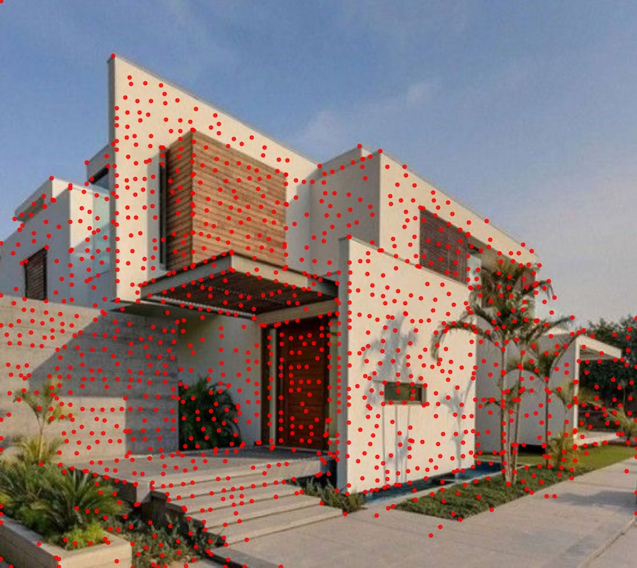

# Wireframe Detector 🔷

**Wireframe Detector** is a deep learning model for joint detection of **wireframes** (structural line segments) and **keypoints with descriptors** in images. The model is trained using **knowledge distillation** from the expert models [HAWP](https://github.com/cherubicXN/hawp) and [DISK](https://github.com/cvlab-epfl/disk), effectively combining both high-level geometric understanding and local feature precision.

---

## 🛠️ Installation

We recommend using a Python virtual environment to isolate dependencies.

### 1. Clone the repository

```bash
git clone https://github.com/iferfra/wireframe-detector.git
cd wireframe-detector
```
### 2. Create and activate a virtual environment
```bash
python -m venv wireframe-detector
source wireframe-detector/bin/activate  
```

### 3. Install dependencies using pyproject.toml
```bash
pip install -e .
```
### 💡 Notes
If you encounter installation issues (e.g. with torch or opencv-python), install those manually first:
```bash
pip install torch torchvision torchaudio
pip install opencv-python
pip install -e .
```
---

## 🖼️ Example Outputs

Inference results using the provided distilled checkpoint.

| Wireframes & Keypoints |
|-----------------------|
|  |
|  |
|  |
|  |

> Outputs are saved automatically with a `_pred.jpg` suffix in the same folder as the input.

---

## 🧪 How to Run Inference

To run inference on your own image using the pretrained checkpoint:

```bash
python -m scripts.inference \
  --image media/test2.jpg \
  --checkpoint checkpoints/checkpoint.pth \
  --device cuda  # use 'cpu' if CUDA is not available
```

## 📚 Third-Party Attribution & Licensing

This repository includes code adapted from [HAWP](https://github.com/cherubicXN/hawp), developed by Nan Xue et al., distributed under the MIT License.

The original license is available in [`LICENSES/HAWP_LICENSE`](LICENSES/HAWP_LICENSE).

### 📄 License
This repository is licensed under the MIT License. See the [`LICENSES/LICENSE`](LICENSES/LICENSE) file for details.


